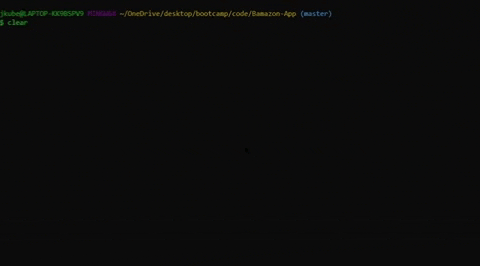
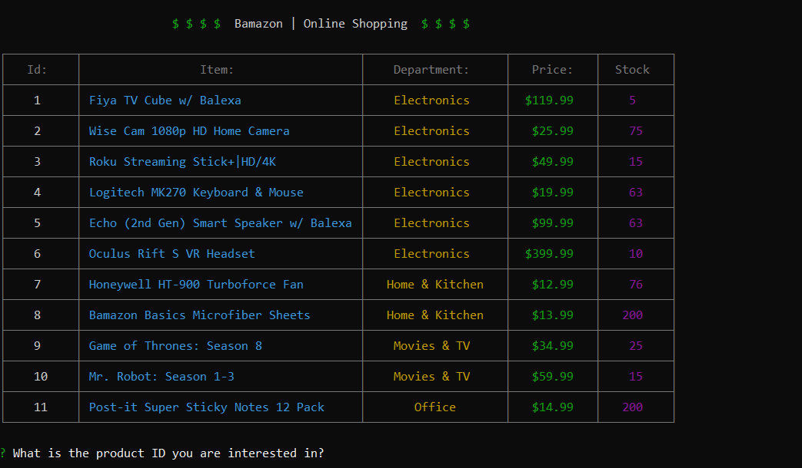
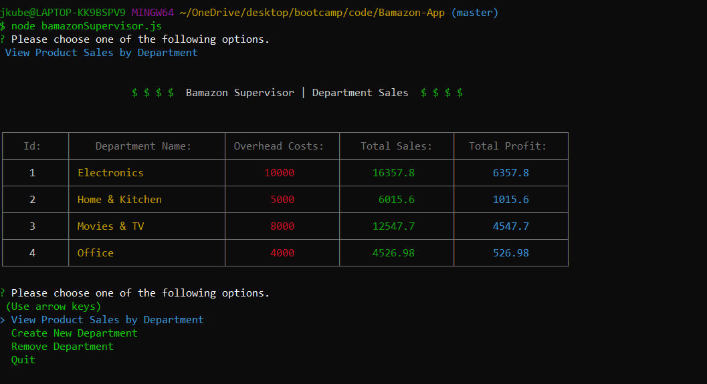

# Bamazon-App

## About Bamzon
Bamazon is an Amazon-like storefront application that stores data using hardcore MySQL skills. The app takes in orders from customers and depletes stock from the store's inventory. As a bonus, the app has been programmed to track product sales across the store's departments and then provides a summary of each departments gross sales in the store.



## How to Use 🤔

The user has 3 different javascript app file commands to choose from.

`node bamazonCustomer.js`

* Running this application first displays all of the items available for sale. Then the user is prompted with two messages:

    * What is the ID of the product they would like to purchase.
    * How many units of the product they would like to purchase.



`node bamazonManager.js`

* Running this application lists the following set of menu options for the user:

    * View Prodcuts for Sale
    * View Low Inventory
    * Add to Inventory
    * Add New Product

* The user is able to view products with an inventory of less than 5.
* The user is able to replenish the inventory of any chosen product.
* The user is able to add/remove any new or existing product to/from the store.


`node bamazonSupervisor.js`

* Running this application lists the following set of menu options for the user:

  * View Product Sales by Department
  * Create New Department
  * Remove Department

* The user is able to view total product sales and total profit for entire departments

* The user is able to add/remove any new or existing department to/from the store.

* This applications utilizes a seperate table in the database to store the *total sales* number for each department.

  * There's a hard coded *overhead-costs* number added to each department

  * A final column **Total Profit** is calculated on the fly by using the *overhead-costs* and the *total sales*



## How it Works 🔨 

The user initializes the app by running the any of the 3 javascript files. 

The **NPM Package** `inquirer` is called when the logic of the application is ran. This *prompts* the user for input, which is then stored and further used for various functions throughout the app.

``` 
// Allow supervisor to create a brand new department in the database
function promptAdd() {

    inquirer.prompt([
        {
            type: "input",
            message: "Please enter the name of the department you would like to add?",
            name: "name",
        },
        {
            type: "input",
            message: "What are the overhead costs of this department?",
            name: "cost",
            filter: Number
        }
    ])
    .then(answers => {
        
        // Store user input as variables to pass as arguments
        let depName = answers.name;
        let depCost = answers.cost;

        // Pass department data thru addDepartment
        addDepartment(depName, depCost);
    });
}

function addDepartment(name, cost) {

    // Update database
    let query = "INSERT INTO departments SET ? ";

    connection.query(query, 
        [
            {
                department_name: name,
                over_head_costs: cost,
            }
        ],
    function(err, res) {
        if (err) throw err;
        console.log("\n\n                        $ $ $ $ ".green + " Bamazon Supervisor | ".white + colors.yellow(name) +" Department Added ".white +  " $ $ $ $\n\n".green);
        supervisorPrompt();
    });
}
```

## Pre-Requisites

To power this app, you'll need to a install a few `NPM Packages`. Downloading the following Node packages is crucial for this applications functionality.

* Colors `npm install colors`
* Inquirer `npm install inquirer`
* MySQL `npm install mysql`
* Table `npm install cli-table3`

## Getting Started 🏁

The following steps will get you a copy of the application up and running on your local machine for testing and grading puproses.

1. Copy this repository from github by using clone.
2. Git clone repository in IDE of choice
3. Navigate to proper directory in IDE
4. If all pre-requisites are met, initalize the app by typing any of the following commands:
  * `node bamazonCustomer.js`
  * `node bamazonManager.js`
  * `node bamazonSupervisor.js`
5. ENJOY!

## Technologies Used 💻

* Git
* Inquirer
* Javascript ES6
* JSON
* MySQL
* Node.js
* NPM
* VS Code

## Creator ✋

**Joey Kubalak**

AKA 

👇

*Treez* 🌲

Github profile 👉 [TreezCode](https://github.com/TreezCode)
