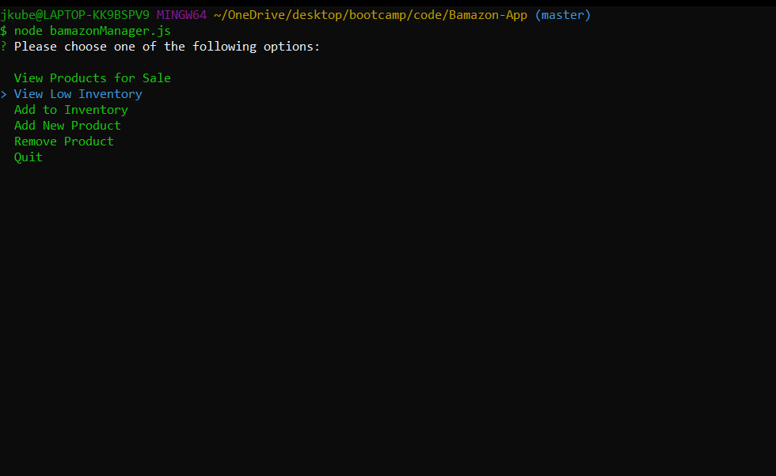

# Bamazon-App

## About Bamzon
Bamazon is an Amazon-like storefront application that stores data using hardcore MySQL skills. The app takes in orders from customers and depletes stock from the store's inventory. As a bonus, the app has been programmed to track product sales across the store's departments and then provides a summary of each departments gross sales in the store.


## How to Use 🤔

The user has 3 different javascript app file commands to choose from.

`node bamazonCustomer.js`

* Running this application first displays all of the items available for sale. Then the user is prompted with two messages:
    * What is the ID of the product they would like to purchase.
    * How many units of the product they would like to purchase.


`node bamazonManager.js`

* Running this application lists the following a set of menu options for the user:
    * View Prodcuts for Sale
    * View Low Inventory
    * Add to Inventory
    * Add New Product



`node bamazonSupervisor.js`


<!-- **Remember**

If the user correctly guesses all of the hidden letters they receive a `You Win` and their `wins` increase by 1

BUT...

If the user reaches 0 guesses they receive a `Game Over` and their `losses` increase by 1

## How it Works 🔨

### Game Logic 🎮 

The user starts the game by running the `node index.js` command to initialize the app. There are 3 seperate `js` files that are utilized to perform the logic. The files are isolated by *letter*, *word*, and *index* (main logic) functions, and then exported to be used together.

The **NPM Package** `inquirer` is called when the main logic of the application is ran. This *prompts* the user for input, which is then stored and further used for various functions throughout the game.

``` 
  // Begin user prompt if the word is not complete
  if (wordComplete.includes(false)) {
    inquirer.prompt([
      {
        type: "input",
        message: "Guess a letter from A to Z  ".white + "=>" ,
        name: "userInput"
      }
    ]).then(input => {

        // Validate user input
        if (!alphabet.includes(input.userInput) || input.userInput.length > 1) {

          console.log("\nPlease enter a letter from A to Z... ONE at a time! >.< \n".cyan);
          gameLogic();
        } else {
          if (wrongLetters.includes(input.userInput) || correctLetters.includes(input.userInput) || input.userInput === "") {
            console.log("\nYou've already tried that letter or nothing was entered!\n".cyan);
            gameLogic();
          } 
            // User input is valid then do this logic
            else {

            let checkerArray = [];

            cpuWord.userGuess(input.userInput);
            cpuWord.objArray.forEach(wordCheck);

            if (checkerArray.join("") === wordComplete.join("")) {
              console.log("\r\n                * * * ".rainbow + "INCORRECT!".red + " * * *\r\n".rainbow);
              wrongLetters.push(input.userInput);
              guessesLeft --;
            } else {
              console.log("\r\n                * * * CORRECT! * * *\r\n".yellow);
              correctLetters.push(input.userInput);
            }

            // Handle the guesses left
            if (guessesLeft > 0) {
              gameLogic();
            } else {
              losses++;
              console.log("              * * * * ".red + "GAME OVER!".bgRed.black + " * * * * \n".red);
              playAgain();
            }
            function wordCheck(key) {
              checkerArray.push(key.isGuessed);
            }
          }
        }
    });
```

#### Screenshots 📷


## Pre-Requisites

To power this app, you'll need to a install a couple `NPM Packages`. Downloading the following Node packages is crucial for this applications functionality.

* Inquirer `npm install inquirer`
* Colors `npm install colors`

## Getting Started 🏁

The following steps will get you a copy of the application up and running on your local machine for testing and grading puproses.

1. Copy this repository from github by using clone.
2. Git clone repository in IDE of choice
3. Navigate to proper directory in IDE
4. If all pre-requisites are met, initalize game by typing `node index.js`!
5. ENJOY! -->

## Technologies Used 💻

* Git
* Inquirer
* Javascript ES6
* JSON
* Node.js
* NPM
* VS Code

## Creator ✋

**Joey Kubalak**

AKA 

👇

*Treez* 🌲

Github profile 👉 [TreezCode](https://github.com/TreezCode)